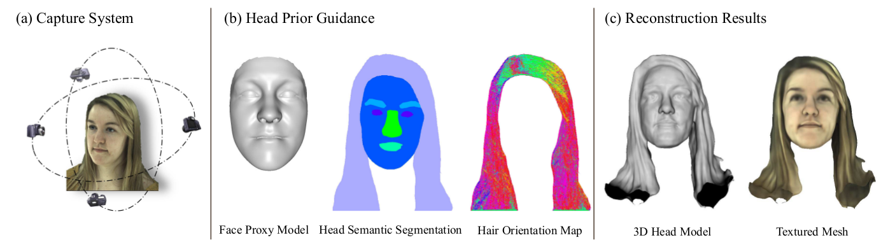

# Prior-Guided Head MVS


This repository includes some reconstruction results of our IEEE TMM 2021 paper, [Prior-Guided Multi-View 3D Head Reconstruction](https://arxiv.org/abs/2107.04277).

Authors: Xueying Wang, Yudong Guo, Zhongqi Yang and [Juyong Zhang](http://staff.ustc.edu.cn/~juyong/).

Note that all of the results are protected under patent. It can be only used for research purposes. If you are interested in business purposes/for-profit use, please contact Juyong Zhang (the corresponding author, email: juyong@ustc.edu.cn).

## Dataset
We applied our multiview head reconstruction method to 2D images from the [3DFAW-video repository](https://3dfaw.github.io/). We reconstructed 3D head models from around 30 high-resolution multi-view images of each subject. 

## Citation
Please cite the following paper if it helps your research: 
```
@article{wang2021prior,
  title={Prior-Guided Multi-View 3D Head Reconstruction},
  author={Wang, Xueying and Guo, Yudong and Yang, Zhongqi and Zhang, Juyong},
  journal={IEEE Transactions on Multimedia},
  year={2021},
  publisher={IEEE}
}
``` 

## Acknowledgement
This research is partially supported by National Natural Science Foundation of China (No. 62122071), the Youth Innovation Promotion Association CAS (No. 2018495), “the Fundamental Research Funds for the Central Universities” (No. WK3470000021).